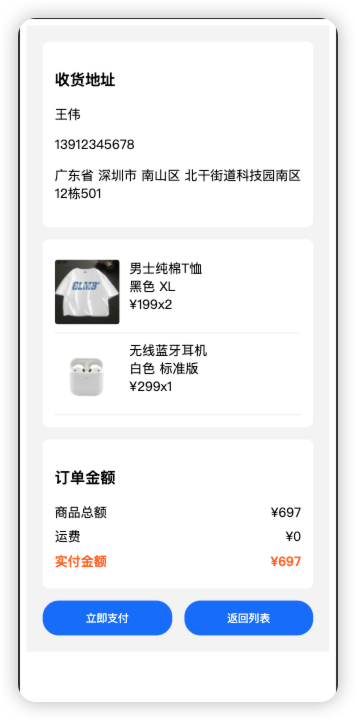

<h1 align="center">prerender_skeleton</h1>
<p align="center">
  <em>适用于vite的预渲染+骨架屏插件</em>
</p>

# Monorepo for the following NPM packages


## About prerender_skeleton

该插件主要是为了优化单页面应用的白屏时间，使用预渲染+骨架屏形式对一些关键性改造，从而实现秒开效果

该插件是基于[prerenderer](https://github.com/Tofandel/prerenderer/tree/%40prerenderer/renderer-puppeteer%401.2.4)的设计理念上加入了自动化骨架屏方案

***需要注意的是因为存在多个HTML文件，所以该插件只适用于 HTML5 navigation(history模式)***

## Example `prerender_skeleton` Usage

```typescript
import prerenderSkeleton from '@prerender_skeleton/plugin'
import { defineConfig } from 'vite'

const Renderer = prerenderSkeleton.Render
// https://vite.dev/config/
export default defineConfig({
  plugins: [
    prerenderSkeleton({
      routes: [{ path: '/orderDetail', skeleton: true }],
      // 静态文件目录
      staticDir: path.join(__dirname, 'dist'),
      // 是否压缩 HTML 文件
      //  minify: true,
      // 网络请求失败、404 错误等情况下应该返回的 HTML 文件
      indexPath: 'index.html',
      // 渲染时是否显示浏览器窗口，值写false可用于调试
      renderer: new Renderer({
        launchOptions:{
          devtools:true
        },
        renderAfterDocumentEvent:"__renderOver",
        viewport: {
          width: 390,
          height: 844,
          isMobile: true,
          deviceScaleFactor: 3,
          hasTouch: true,
        },
        injectProperty: '__skeleton_mock',
        // Optional - Any values you'd like your app to have access to via `window.injectProperty`.
        headless: false,
        // renderAfterTime: 5000, // Wait 5 seconds.
        consoleHandler: (route, message) => {
          if (message.type() === 'error') {
            console.log('route is', route, 'message is', message)
          }
        },
      }),
      server: {
        // Normally a free port is autodetected, but feel free to set this if needed.
        port: 9892,
      },
    }),
  ],
})

```

在页面组件渲染完成后(创建/关闭)骨架屏

```typescript
import { ref, onMounted } from 'vue'
import axios from 'axios'
import { dispatchRenderEvent } from '@prerender_skeleton/plugin/renderComplate'

onMounted(async () => {
  try {
   	// ***接口请求结束完成
    dispatchRenderEvent('__renderOver')
  } catch (error) {
    console.error('数据加载失败:', error)
  }
})
```

效果图

<div style='display:flex;align-items:center'>


</div>

## Documentation

所有软件包均使用 TypeScript 进行了强类型定义，如果某些文档缺失或存在疑问，我们建议参考这些类型定义。

### Installation

```bash
npm i @prerender_skeleton/plugin
yarn add @prerender_skeleton/plugin
pnpm i @prerender_skeleton/plugin
```

### PrerenderSkeletonOption

| Option      | Type                                                 | Required? | Default                | Description                                                  |
| ----------- | ---------------------------------------------------- | --------- | ---------------------- | ------------------------------------------------------------ |
| staticDir   | String                                               | Yes       | None                   | 预渲染器服务启动时你本地打包资源目录                         |
| indexPath   | String                                               | No        | `staticDir/index.html` | 本地资源找不到时SPA回退的首页                                |
| server      | Object                                               | No        | None                   | 预渲染器服务 (见下文)                                        |
| renderer    | IRenderer Instance, constructor or String to require | Yes       | None                   | 渲染器，预渲染器使用它去预渲染APP页面                        |
| postProcess | (renderedRoute: Route, routes: Route[]) => void      | No        | None                   | 允许你在将渲染内容写入文件之前自定义 HTML 和输出路径，还可以通过向路由参数中添加内容来定义自己的路由 |
| routes      | Array<RouteItem>                                     | Yes       | None                   | 要预渲染页面的路由配置                                       |

### RouteItem

| Option             | Type    | Required? | Default | Description                                      |
| ------------------ | ------- | --------- | ------- | ------------------------------------------------ |
| path               | String  | Yes       | None    | 预渲染的路由path                                 |
| skeleton           | Boolean | Yes       | None    | 是否生成骨架屏                                   |
| animation          | Boolean | No        | Yes     | 骨架屏动画                                       |
| minGrayBlockWidth  | Number  | No        | 30      | 最小骨架屏元素宽度，小于该宽度则不渲染骨架屏     |
| minGrayPseudoWidth | Number  | No        | 30      | 最小骨架屏伪类元素宽度，小于该宽度则不渲染骨架屏 |


### Server Options

| Option | Type    | Required? | Default                    | Description                                                  |
| ------ | ------- | --------- | -------------------------- | ------------------------------------------------------------ |
| port   | Integer | No        | First free port after 8000 | 预渲染器服务运行的端口。                                     |
| proxy  | Object  | No        | No proxying                | 代理配置。与 [webpack-dev-server](https://webpack.js.org/configuration/dev-server/#devserver-proxy)的配置相同。 |
| host   | String  | No        | 127.0.0.1                  | 预渲染器服务运行的host                                       |

###  PuppeteerRendererOptions

所有选项均非必填项，默认情况下，当Puppeteer准备就绪（即DOMContentLoaded事件触发时），页面将会进行渲染。

| Option                   | Type                                                         | Default                | Description                                                  |
| ------------------------ | ------------------------------------------------------------ | ---------------------- | ------------------------------------------------------------ |
| maxConcurrentRoutes      | Number                                                       | 0 (No limit)           | 允许同时渲染的路由数量。                                     |
| inject                   | Object                                                       | None                   | 一个在渲染页面完成加载之前注入到其全局作用域的对象。该对象必须能够被 `JSON.stringify` 序列化。默认情况下，注入的属性为 `window['__PRERENDER_INJECTED']`。 |
| injectProperty           | String                                                       | `__PRERENDER_INJECTED` | 渲染期间挂载注入的目标属性。如果未设置注入，则不起作用。     |
| renderAfterDocumentEvent | String                                                       | None                   | 等待在文档上触发指定事件后表示渲染完成，之后就可以根据渲染出来的HTML进行骨架屏生成。 |
| renderAfterTime          | Integer (Milliseconds)                                       | None                   | 等待一定时间后再进行骨架屏生成。                             |
| renderAfterElementExists | String (Selector)                                            | None                   | 等待使用 `document.querySelector` 检测到指定元素后再进行骨架屏生成 |
| elementVisible           | Boolean                                                      | None                   | 等到 renderAfterElementExists 可见再进行骨架屏生成           |
| elementHidden            | Boolean                                                      | None                   | 等到 renderAfterElementExists 被隐藏再进行骨架屏生成         |
| timeout                  | Integer (Milliseconds)                                       | 30000                  | 如果在等待事件或元素时触发此超时，骨架屏生成将中止并报错。   |
| skipThirdPartyRequests   | Boolean                                                      | `false`                | 自动阻止任何第三方请求。（这可以通过不加载非必要的脚本、样式或字体来使您的页面加载得更快。） |
| headless                 | Boolean                                                      | `true`                 | 是否以无头模式运行浏览器，debug时可以设置为false             |
| consoleHandler           | function(route: String, message: [ConsoleMessage](https://github.com/GoogleChrome/puppeteer/blob/master/docs/api.md#class-consolemessage)) | None                   | 允许你为页面提供自定义的 console.* 处理程序。传递给函数的第一个参数是要渲染的路由，第二个参数是 [Puppeteer ConsoleMessage](https://github.com/puppeteer/puppeteer/blob/main/docs/api/puppeteer.consolemessage.md) 对象. |
| viewport                 | [Viewport](https://github.com/puppeteer/puppeteer/blob/main/docs/api/puppeteer.viewport.md) | None                   | 这些选项将被传递给 puppeteer.launch()。表示渲染设备的视口大小等 |
| launchOptions            | [LaunchOptions](https://github.com/puppeteer/puppeteer/blob/main/docs/api/puppeteer.launchoptions.md) | None                   | 这些选项将被传递给 puppeteer.launch()。                      |
| navigationOptions        | [WaitForOptions](https://github.com/puppeteer/puppeteer/blob/main/docs/api/puppeteer.waitforoptions.md) | None                   | 这些选项将被传递给 page.goto()，例如 timeout: 30000ms。      |

### Sketelon attrs

| Attr                  | Description                    |
| --------------------- | ------------------------------ |
| data-skeleton-remove  | 在骨架屏中删除该元素           |
| data-skeleton-ignore  | 在骨架屏中忽略该元素           |
| data-skeleton-empty   | 在骨架屏中清空该元素的子元素   |
| data-skeleton-bgcolor | 在骨架屏中自定义该元素的背景色 |

## Contributing

This is a monorepo, using `changeset`, so you'll need to clone the repository, then use changeset to publish

## Maintainers

<table>
  <tbody>
    <tr>
      <td align="center">
        <a href="https://github.com/zjjaxx">
          
          </br>
          zjjaxx
        </a>
      </td>
</tr>
</tbody>
</table>


